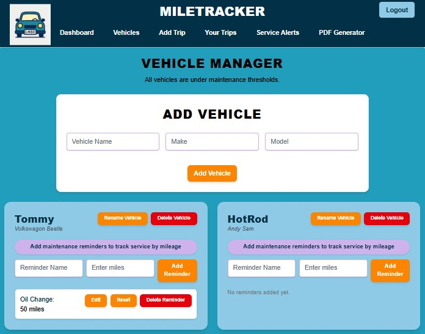
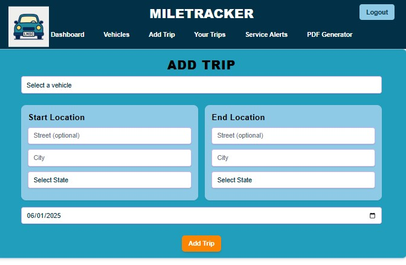

# 🚗 MileTracker

**MileTracker** is a full-stack MERN application that allows users to track trips by logging a start and end location, automatically calculating mileage, showing weather at the destination, and exporting trip history as a PDF report.

Built for the final project in my full-stack bootcamp, this app uses React, Apollo Client, GraphQL, Node.js, Express, and MongoDB with Mongoose. It also includes JWT authentication, secure API key usage, and continuous deployment through Render and GitHub Actions.

---

## 🔧 Technologies Used

- **Frontend:** React, Vite, Apollo Client, TypeScript
- **Backend:** Node.js, Express, GraphQL (Apollo Server), Mongoose
- **Database:** MongoDB Atlas
- **Authentication:** JSON Web Tokens (JWT)
- **APIs:** OpenRouteService (mileage), OpenWeatherMap (weather), UselessFacts and National Park Service (funfacts), and Google Maps
- **CI/CD:** GitHub Actions
- **Deployment:** Render

---

## 🚀 Features

- 🧭 **Add trips** by entering a start and end location
- 📏 **Automatically calculates miles**
- 🌦️ **Displays weather** for the destination
- 🗑 **Delete trips** individually
- 📄 **Download a PDF** report of all logged trips
- 🔐 **User authentication** with JWTs
- 📦 **Protected API keys** in environment variables
- ⚙️ **GitHub Actions** runs type checks on every push

---

## 🔒 Authentication

Register and log in with a username and password. Authenticated users have private trip data and token-secured access to all features.

---

## 🌍 Live Demo

- **Frontend:** [https://miletracker-client.onrender.com](https://miletracker-client.onrender.com)
- **Backend (GraphQL API):** [https://miletracker-wokk.onrender.com/graphql](https://miletracker-wokk.onrender.com/graphql)

## 📸 Screenshots

### Login Page


### Home Page


### Vehicle Manager Page



### Add Trip Page



### Your Trips Page


### Trip Report Printer Page


<!-- ### Expense Report Printer Page

-->

---

## 🧪 Local Development

1. Clone the repo
2. Run the backend:

```bash
cd server
npm install
npm run start
```

Run the Front End

```bash
cd client
npm install
npm run dev
```

MONGODB_URI=your_mongo_uri
JWT_SECRET=your_jwt_secret
OPENROUTE_API_KEY=your_route_api_key
WEATHER_API_KEY=your_weather_api_key

🔁 Git Branching Strategy
To keep the main branch clean and production-ready, all development happens through a shared dev branch. Individual features and fixes are built on personal branches, then merged into dev via pull request. Once dev is stable, it’s merged into main.

🛠 Branch Setup
main — 🚀 Deployed production code

dev — 🧪 Staging branch for active development

yourname/task-name — 🧱 Feature branches off of dev

🧑‍💻 Workflow
Pull the latest dev branch:

bash
git checkout dev
git pull origin dev

Example:
Create a personal feature branch:
git checkout -b liebe/navbar

Push your branch:
git push -u origin liebe/navbar
Open a pull request into dev when your feature is ready.

✅ Tips:

To keep things clean and collaborative, we follow a [yourname]/[task-name] branch naming format.
Use dashes (-) and not spaces.
Open PRs into dev, not main.

🌿 Branch Naming Guide

TASK SUGGESTED BRANCH NAME

CSS and overall UI styling yourname/css-pass
Create and style the Navbar yourname/navbar
Build and style the Footer yourname/footer
Support multiple vehicles yourname/multi-vehicle-support
Add maintenance reminders (oil, tires, etc.) yourname/maintenance-reminders
Improve search with address/state/date filters yourname/expand-search-filters
Begin turning the app into a PWA yourname/pwa-setup
Improve PDF layout and appearance yourname/pdf-beautification

👏 Credits

Developed by Liebe, Colton, Maddie and Stephen as the final capstone project for a full-stack JavaScript bootcamp. Built with ❤️, APIs, and very little sleep.
